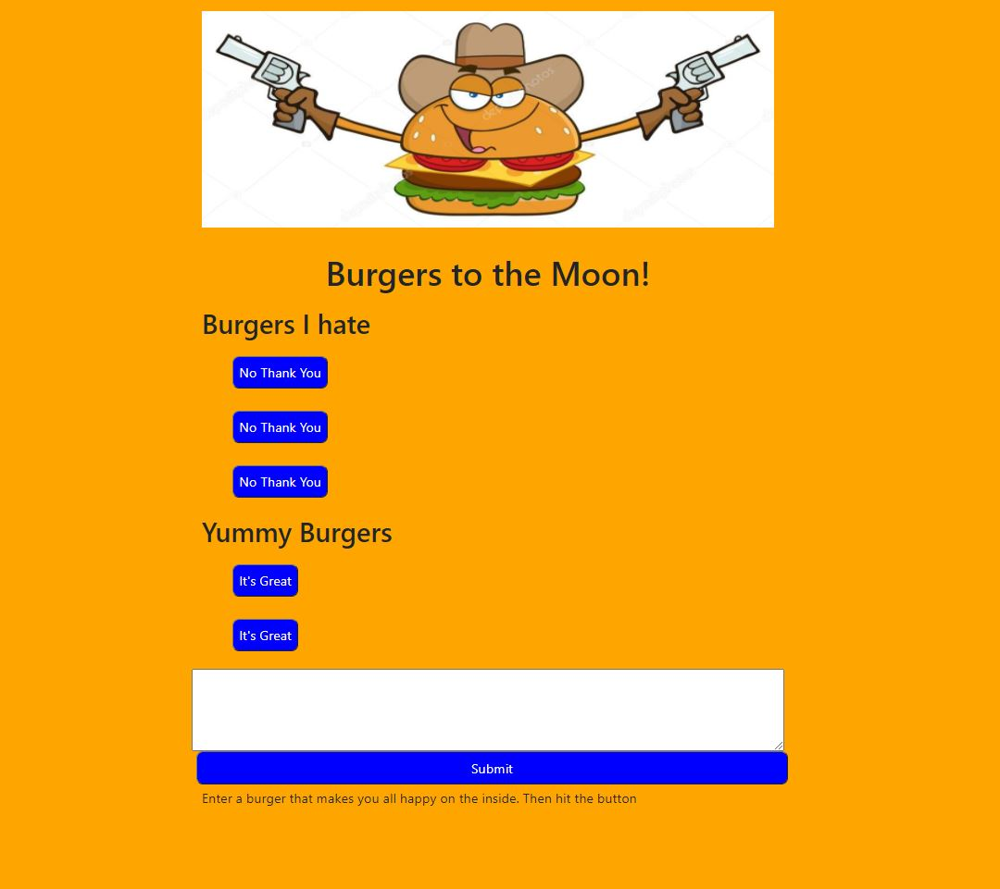

# Burger

## Description

This project builds a command-line application that allows the user to track employees within a company.  The user will be able to view departments, roles, and employees.  Add departments, roles, and employees.  Update employees roles in a situation where an employee gets a promotion.  Lastly the user can delete departments, roles, and employees.  The application uses MySQL to create a local database.  It also uses the inquirer package to prompt the user with questions within the command-line.

## Developer 
 
 

Link to Deployment: [Burger Application]()

## Fucntionality

## Bugs and Issues
Found a bug? Review any [open issues][open-issues] or create a [new issues here][new-issue] so we can fix it for you!

## License
This application does not hold any licenses.

[open-issues]: https://github.com/dbridgman1/burger/issues
[new-issue]: https://github.com/dbridgman1/burger/issues/new